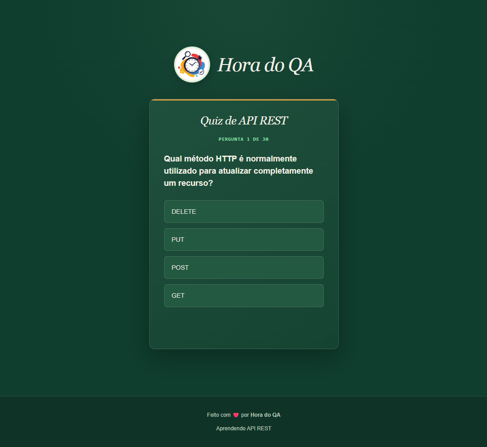

# Quiz API REST

Desafia-se neste quiz que avalia seus conhecimentos em API REST.

<div align="center">

</div>

## Status Github Actions


## O jogo

Um quiz simples com 30 perguntas de múltipla escolha. A cada resposta, o jogo mostra se você acertou ou errou, soma a pontuação e, ao final, exibe uma mensagem de acordo com o resultado.

## Tecnologias

- *HTML, CSS e JavaScript* - Contruindo a página
- *http-server* — servidor local simples, usado só para servir o jogo durante os testes
- *GitHub Actions* — roda os testes automaticamente a cada push


## Estrutura do projeto

```bash
📁 quiz-cypress/
├── 📁 assets
│   ├── logo.png
│   ├── script.js
│   └── styles.css
└── index.html
├── 📁 .github/workflows/tests.yml
└── README.md 
```

## Como acessar o jogo: 
